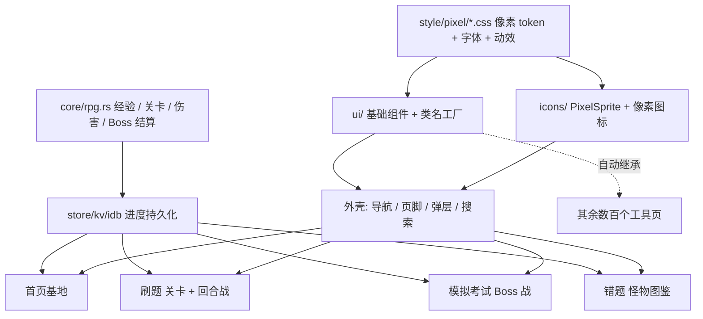

## 产品概述
将业余无线电考试应用的界面与核心交互整体升级为像素艺术（Pixel Art）风格，并把学习流程重构为 RPG 闯关体验。视觉从"极光 + 玻璃"换成"复古掌机 / 16 位像素"。现有交互可以完全重新设计，不需要兼容旧逻辑。

## 范围（已与用户确认）
- **全局换肤**：设计 token、全部基础 UI 组件、顶栏 / 导航 / 页脚等外壳、图标、字体、动画与过渡。
- **4 条核心流程重做**：首页、刷题、模拟考试、错题。
- 其余几百个工具页和知识页不逐页重做，靠组件与 token 自动继承像素外观。
- 保留亮 / 暗两套主题，换成像素调色板。
- 保留 zh / en / es 三语。
- 尊重"减少动态效果"系统偏好，并提供应用内"像素动效 / 静态"降级。

## 核心功能
- **像素视觉**
  - 硬边描边、阶梯切角、无模糊的偏移阴影、零圆角。
  - 限色调色板，纹理用抖动（dither）点阵。
  - 像素字体：拉丁 / 数字 / HUD 用像素字体，中文用子集化像素字体。
  - 像素图标与精灵：全站图标统一像素化，成就换成像素徽章。
- **像素组件**
  - 按钮有"凸起 → 按下位移"的手感。
  - 输入框是凹陷的内描边，焦点用阶梯式闪烁光标框。
  - 弹层是"对话框窗口"：标题栏加关闭钮。
  - 进度条是分段的血条 / 经验条。
  - 开关、复选框、单选、滑块都是像素造型。
- **像素动画**
  - 逐帧 `steps()` 动画：按钮按下、精灵待机、受击抖动、闪烁、打字机文字、像素溶解式页面转场。
  - 减少动态时全部降为静态帧。
- **RPG 化核心流程**
  - **首页 = 像素"基地"**：角色 HUD（等级、经验、连续天数、体力 / 生命）、今日任务、每日挑战、复习提醒、进入学习地图、成就墙。
  - **刷题 = 关卡地图 + 回合战斗**：按题库分类形成关卡节点，逐级解锁。答对造成伤害并得经验，答错扣血并自动进错题集。每关结算给星级。
  - **模拟考试 = Boss 战**：Boss 血条表示剩余题数 / 及格线，倒计时用像素沙漏 / 计时条。结算页展示评级、战利品、经验和是否通关。
  - **错题 = 怪物图鉴 / 复仇**：每道错题是一只"怪物"，按薄弱专题分组。复习答对即"击败"，图鉴记录击败进度。
- **可用性保障**
  - 提供"易读字体"开关，在长题面和解析区可切回抗锯齿字体。
  - 文字对比度达标，键盘全程可操作，焦点可见。
  - 无障碍名与标签关联保持完整。


## 技术栈（沿用现有，不引入新框架）
- Rust 2024 + Leptos 0.8（WASM，trunk 构建）+ Tailwind CSS v4.1.14（trunk 自动下载独立二进制）。
- 样式入口是 `crates/app/style/input.css`（约 48KB，已用 `@import` 引入 `tw-animate.css`）。
- 字体放在 `public/fonts/*.woff2`，由 `index.html` 的 `copy-dir` 拷入产物。
- 纯逻辑进 `ham-web-core`（`crates/core`），`crates/app` 只负责 DOM 与视图。
- E2E 用 Playwright（`e2e/tests/*.spec.ts`）。

## 实现思路
**核心策略：保留 shadcn 语义 token 名，只替换值与材质，再靠"组件唯一来源"一次性改外观。**
- 全站几百个页面都用 `bg-card` / `text-primary` / `border` / `rounded-*` / `shadow-*` 等类名，也都走 `ui/` 组件。
- 所以把 `--background` / `--primary` / `--border` 等换成像素调色板的 sRGB 值。
- 同时把 `--radius-*` 归零、`--shadow-*` 改成硬偏移阴影。
- 这样未改动的页面会自动继承像素外观。
- 再在 `ui/` 的类名工厂和各控件里叠加像素专属类，让按钮、输入框、弹层有完整的像素细节。
- RPG 化只对 4 条核心流程做结构性重写。

**关键决策与取舍**
1. **CSS 拆分**
   - 新增 `style/pixel/` 目录（tokens、fonts、surfaces、motion、sprites），由 `input.css` 通过 `@import` 引入。
   - 旧的极光、玻璃、渐变文字、Web Threads 画布、光斑跟随、涟漪等段落从 `input.css` 删除。
   - 保留与外观无关的功能性 CSS（滑块结构、折叠面板、打印、滚动条等），改成像素版本。
2. **像素边框**
   - 用 `box-shadow` 阶梯叠层或 `clip-path: polygon` 的阶梯切角实现。
   - 不用 `border-image` 位图，避免多分辨率缩放模糊。
   - 全局 `image-rendering: pixelated`，位图只用整数倍缩放。
3. **圆角处理**
   - `rounded-sm|md|lg|xl` 通过 `@theme` 的 `--radius-*` 归零。
   - `rounded-full` 在 Tailwind v4 里是字面量，改用 `@layer utilities` 的覆盖规则置零。
   - 真正需要圆形的元素（加载圈、状态点）加 `data-keep-round` 豁免。
4. **字体**
   - 展示 / HUD 用 Press Start 2P（SIL OFL），小标签可用 Silkscreen。
   - 正文拉丁与中文统一用点阵中文体（如 Zpix 或缝合像素），保证中西文混排一致。
   - 落地前核对各字体许可证，并写入 `public/fonts/LICENSES`。
   - 中文子集化：字符集取 GB2312 常用字 + 全部标点 + 实际出现在 `data/**/*.json` 的汉字。
   - 按 `unicode-range` 切成多个 woff2 分片，只加载用到的分片。
   - 子集脚本放在 `crates/tools`（已有 13 个 rs），挂成 `cargo make` 任务，字体产物提交入库。
   - 字体栈末尾保留系统中文字体兜底，覆盖生僻字。
   - 字号取点阵原生字号的整数倍；正文 `-webkit-font-smoothing: none`。
   - 设置里提供"易读字体"开关，在题面和解析区切回 Geist 和系统字体。
5. **图标分层策略**
   - 现有 `Icon` 渲染的是 Lucide 描边 SVG（`IconKind`，`kind.body()`）。
   - 先 grep 统计 `IconKind` 使用频次。
   - 高频图标（约 40–60 个）手绘 16×16 点阵，用 `PixelSprite` 渲染，对外 API（`Icon` + `IconKind`）不变。
   - 长尾图标回退到"方头方角 + `shape-rendering: crispEdges` + 24 网格整数尺寸"的 Lucide，保证风格接近、不会缺图。
   - 精灵数据是紧凑的字符行 + 调色板索引，渲染时按颜色合并成少量 `<path>`，开销可忽略。
   - 成就徽章、角色、Boss、怪物同样走 `PixelSprite`。
   - `crates/core/src/achievements.rs` 里的 emoji 保持不变，由 app 层按成就 id 映射到精灵，避免 core 依赖视图。
6. **RPG 逻辑放 core**
   - 新增 `crates/core/src/rpg.rs`，带单元测试。
   - 内容包括：经验与等级曲线、关卡解锁与星级判定、答题伤害与生命结算、Boss 战评级与战利品、错题"怪物"的击败进度。
   - 数据复用已有来源：`learning_path.rs`、`categories.rs`、`exam.rs`（`ExamRule` / `ExamScore`）、`daily_challenge.rs`、`achievements.rs`、`card_review.rs`。
   - 持久化沿用 `store` / `kv` / `idb` 与 `saved_state::keys`。
   - 新增进度字段要有默认值，兼容旧用户数据，不迁移也不丢数据。
   - `backup_merge.rs` 若覆盖了对应键，需同步纳入备份合并。
7. **动效**
   - 把 `--ease-*` 曲线 token 改为 `steps(n)`，并新增 `--px-frame`（约 80–120ms/帧）。
   - `motion.rs` 的滚动浮现、路由过渡、错峰逻辑保留，把"淡入 + 位移"换成"逐帧像素溶解 / 分段滑入"。
   - 删除光斑跟随（`install_spotlight` 及 `.spotlight`）。
   - 降级沿用 `motion.rs` 的两级开关思路：不支持 IntersectionObserver 或开启减少动态时不加 `.js-motion`，内容保持可见。
   - 新增应用内"像素动效"开关，在 `<html>` 上写 `data-pixel-motion="off"`。
   - 所有逐帧动画都包进 `@media (prefers-reduced-motion: reduce)` 与该属性下的静态帧。
8. **背景**
   - 删除 `body::before` / `::after` 极光层和 WebGL 的 Web Threads 背景。
   - 换成纯 CSS 的静态抖动底纹，暗色加稀疏星点，用 `steps()` 慢闪。
   - 先评估 `components/web_threads*.rs`、`web_threads.rs` 是否还有其它引用。无引用就一并删除并清理依赖，避免 dead-code 触发 clippy 的 `-D warnings`。

## 实施注意事项
- **仓库硬规则**
  - 一个文件一个组件，一族组件用文件夹模块。
  - 页面不写原生控件，不直接调用类名工厂。
  - 所有文案走 `t("域.词条")`，字面量写在调用点。
  - 新增词条需在 `data/i18n/{zh,en,es}/<域>.json` 三语齐全，再跑 `cargo make i18n-pack`。
  - 注释用中文并写"为什么"。
  - 改完跑 `cargo make check`。
- **e2e 契约**
  - `Field` 的 `r#for` 与控件 `id` 配对、图标按钮的 `aria_label`、`role` / `aria-*` 全部保留。
  - 页面结构重做后，按"断言里出现过的属性"全仓搜 spec，同步修正受影响用例。
  - 重点是涉及 practice、exam、mistakes、home 的 spec，以及 `i18n_layout.spec.ts`、`waveform_lab.spec.ts` 等。
- **性能**
  - 像素阴影与阶梯切角不要用大量滤镜。
  - 精灵用整数 viewBox 内联 SVG，同类精灵按 kind 缓存。
  - 字体按分片懒加载，首屏只加载拉丁与 HUD 字体和命中的中文分片，`font-display: swap`。
  - 逐帧动画只动 `transform` / `background-position`，不触发布局。
- **布局与多语言**
  - 像素字体比 Geist 宽，要在英文、西班牙文长词场景检查溢出。
  - 保留现有 `overflow-wrap: break-word` 兜底。
- **爆炸半径控制**
  - 打印样式（`/print`）和 SDR / 波形 / 地图等画布类页面保持功能不变，只继承 token。
  - 不改任何工具页的业务逻辑。
  - 分步提交：每步结束都保证 `cargo make check` 通过、应用可运行。
- **文档同步**
  - 更新 `docs/ui-components.md`（含 §8 刻意例外清单）和 `crates/app/src/ui/README.md`。
  - 写入像素规范：调色板、间距网格、字号、边框 / 阴影、动效规则。
  - 更新 `ui/mod.rs` 头部文档里"shadcn new-york"的描述。

## 架构


## 目录结构
## Directory Structure Summary
本次改动分三层：样式与字体资源（新增 `style/pixel/*`、`public/fonts/*`）、`ui/` 与 `icons/` 的像素化重写、核心逻辑与 4 条流程页面的重做。下面只列主要文件，页面内部的子组件按"一文件一组件"规则拆分。

```
project-root/
├── crates/app/style/
│   ├── input.css                      # [MODIFY] 保留 Tailwind 入口与 @theme 映射；删除极光 / 玻璃 / 渐变文字 / Web Threads / 光斑 / 涟漪等段落；
│   │                                  #          @import ./pixel/*.css；--radius-*、--shadow-*、字号阶梯改为像素值；滑块、折叠面板、进度条、滚动条、骨架屏改像素版。
│   └── pixel/
│       ├── tokens.css                 # [NEW] 亮 / 暗两套像素调色板（sRGB），映射到 --background / --primary / --border 等既有语义 token；
│       │                              #       新增 --px 基准单位、--px-shadow、--px-frame；暗色以 Sweetie-16 一类 16 色板为基调。
│       ├── fonts.css                  # [NEW] Press Start 2P / Silkscreen / 点阵中文体 @font-face，中文按 unicode-range 分片；字体栈与兜底；整数倍字号与 smoothing 设置。
│       ├── surfaces.css               # [NEW] 像素描边、阶梯切角、凹陷 / 凸起、窗口面板、抖动底纹、静态背景；rounded-full 覆盖与 data-keep-round 豁免。
│       └── motion.css                 # [NEW] steps() 关键帧：按下、闪烁、抖动、打字机、溶解转场、精灵待机；
│                                      #       reduced-motion 与 data-pixel-motion=off 的静态降级。
├── public/fonts/
│   ├── pixel-*.woff2                  # [NEW] 像素字体（拉丁 / HUD）与中文子集分片
│   └── LICENSES                       # [NEW] 字体许可证与来源说明
├── crates/tools/src/                  # [NEW] 中文字体子集化工具：扫描 data/**/*.json 与 i18n 词条收集字符集，输出分片与 unicode-range 清单；Makefile.toml 增加对应任务。
├── crates/app/src/
│   ├── ui/
│   │   ├── mod.rs                     # [MODIFY] button_class / badge_class / card_class / label_class 及 CARD_* 常量改像素类；Variant / Size 保持，新增必要的像素变体；更新头部文档。
│   │   ├── button.rs                  # [MODIFY] 像素按钮；加载态用像素旋转精灵；保持 props 与 aria 契约。
│   │   ├── button_link.rs / input.rs / number_field.rs / textarea.rs / checkbox.rs / switch.rs / slider.rs / field.rs / label.rs / separator.rs / stat.rs / file_input.rs / date_picker.rs / time_picker.rs / native_select.rs / popover.rs / control.rs
│   │   │                              # [MODIFY] 各控件像素化：凹陷输入框、阶梯焦点框、像素勾选与滑块、弹层窗口外观；不改对外 props。
│   │   ├── progress.rs                # [MODIFY] 分段血条 / 经验条，保留 value 语义与 aria-valuenow；可选 HP / XP 色调。
│   │   ├── dialog/ / select/ / radio/ / chip/   # [MODIFY] 对话框窗口（标题栏 + 关闭钮）、选项行、单选 / 胶囊的像素造型，子组件各占一文件。
│   │   └── glass/                     # [MODIFY] 空目录，删除或改造为像素窗口面板组件，避免残留。
│   ├── icons/
│   │   ├── mod.rs                     # [MODIFY] Icon 对外 API 不变；优先渲染像素精灵，缺省回退方头方角 + crispEdges 的 Lucide。
│   │   ├── icon_kind.rs / icon_lookup.rs      # [MODIFY] 补充 IconKind 到精灵的映射表。
│   │   └── pixel/                     # [NEW] PixelSprite 组件 + 精灵位图数据（图标、徽章、角色、Boss、怪物）；一个文件一个组件。
│   ├── app/
│   │   ├── mod.rs / main_content.rs / footer.rs / storage_warning.rs   # [MODIFY] 外壳像素化：HUD 顶栏、窗口式内容区、静态像素背景；移除 Web Threads 挂载。
│   ├── components/
│   │   ├── navigation/            # [MODIFY] nav_bar / group_menu / menu / theme_toggle / locale_toggle 改像素 HUD 与下拉窗口；新增"像素动效 / 易读字体"设置入口。
│   │   ├── search_dialog.rs / shortcut_help.rs / question_card.rs   # [MODIFY] 像素窗口外观；题面区支持"易读字体"。
│   │   ├── common/ bank_selector/ practice/ exam/ topic_quiz/ study_plan_card/   # [MODIFY] 随新流程调整，并像素化。
│   │   └── web_threads*.rs / web_threads.rs   # [MODIFY 或 DELETE] 确认无其它引用后删除，并清理相关依赖。
│   ├── motion.rs                  # [MODIFY] 保留滚动浮现 / 路由过渡 / 错峰与降级逻辑；入场改逐帧；删除光斑跟随；读取 data-pixel-motion。
│   ├── theme.rs                   # [MODIFY] 保留亮 / 暗 / 系统；新增像素动效、易读字体两个持久化偏好，沿用 saved_state::keys。
│   ├── store.rs / kv.rs / idb.rs  # [MODIFY] 持久化经验、等级、关卡星级、怪物击败进度；带默认值，兼容旧数据。
│   └── pages/
│       ├── home/                  # [MODIFY] 基地：角色 HUD、今日任务、每日挑战、复习提醒、地图入口、成就墙；各卡片重做为窗口面板，一文件一组件。
│       ├── practice/              # [MODIFY] mod / view / header_bar / bottom_bar / store：关卡地图 + 回合战斗 + 结算；新增地图、战斗舞台、结算子组件。
│       ├── exam/                  # [MODIFY] mod / view / exam_header / exam_bottom_bar / paper / store：Boss 战界面、Boss 血条、结算评级与战利品。
│       └── mistakes/              # [MODIFY] mistakes_page / mistake_card / mistake_diagnosis：怪物图鉴、击败进度、复仇复习。
├── crates/core/src/
│   ├── rpg.rs                     # [NEW] 经验与等级曲线、关卡解锁与星级、答题伤害与生命、Boss 结算与评级、怪物击败判定；纯函数 + 单元测试。
│   └── lib.rs                     # [MODIFY] 导出 rpg 模块。
├── data/i18n/{zh,en,es}/          # [MODIFY] 新增 RPG / HUD / 设置 / 地图 / 战斗 / 结算 / 图鉴等词条（三语齐全），随后 cargo make i18n-pack。
├── e2e/tests/                     # [MODIFY] 修正 home / practice / exam / mistakes 及断言涉及 role / aria 的 spec；新增像素主题与降级的冒烟用例。
├── docs/ui-components.md          # [MODIFY] 更新视觉基线、硬规则、§8 例外清单与像素规范。
└── crates/app/src/ui/README.md    # [MODIFY] 更新组件清单、视觉基线说明、像素类使用示例。
```

## 关键结构（接口级）
```rust
// crates/core/src/rpg.rs —— 纯逻辑，无浏览器依赖，需单测
pub struct PlayerProgress { pub xp: u32, pub streak_days: u32, /* 关卡星级、怪物击败记录等，均带 Default */ }
pub fn level_of(xp: u32) -> (u32 /*等级*/, u32 /*本级已得*/, u32 /*升级所需*/);
pub fn battle_outcome(correct: bool, hp: u8, combo: u32) -> BattleDelta; // 伤害、扣血、经验
```


## 设计定位
桌面优先的 Web，同时保证移动端可用。风格是"16 位掌机 + 复古业余电台"：像素窗口、硬边阴影、扫描线与抖动底纹。信息密度保持克制，题面和解析区的可读性优先。

## 全局视觉语言
- **边框与阴影**：2–4px 硬边描边，四角阶梯切角，阴影是无模糊的 `4px 4px 0` 偏移。卡片叫"窗口面板"，带可选标题栏。
- **背景**：亮色是带细抖动点阵的米色纸张，暗色是深蓝夜空加稀疏星点慢闪。没有渐变、玻璃和模糊。
- **间距与网格**：以 4px 为基本网格，所有尺寸为 4 的倍数；图标 16 / 24 / 32px 整数倍。
- **交互反馈**：按钮悬停上移 2px 变亮，按下下沉 2px 且阴影消失。焦点是 2px 阶梯闪烁框。禁用态是抖动网点遮罩。
- **动画**：全部 `steps()` 逐帧。包含按钮按下、精灵 2–4 帧待机、受击抖动、升级闪光、打字机文字、像素溶解转场。减少动态或"像素动效"关闭时全部静态。

## 全局外壳
1. **顶部 HUD 栏**：左为像素 logo 与站点名，中为主导航，右为等级徽章 + 经验条 + 连续天数 + 主题 / 语言 / 设置。滚动时增加一道像素分隔线。
2. **主内容窗口区**：页面内容放在窗口面板中，路由切换时像素溶解入场。
3. **底部**：移动端是固定的像素 Tab 栏（基地、地图、考试、错题、更多）；桌面端是简洁页脚。
4. **设置面板**：窗口弹层，含主题、语言、像素动效、易读字体。

## 核心页面（4 个）
### 1. 首页 · 基地
- **角色 HUD 区**：像素角色精灵待机动画，旁边是等级、经验条、生命 / 体力、连续天数。
- **今日任务栏**：三条任务卡（每日挑战、复习到期题、继续上次关卡），每条带奖励经验图标。
- **学习地图预览**：横向缩略地图，高亮当前关卡，按钮"出发"进入刷题。
- **功能入口网格**：知识库、工具、日志等以像素图标磚块排列。
- **成就墙**：像素徽章，已解锁彩色，未解锁剪影。

### 2. 刷题 · 关卡地图与回合战斗
- **地图页**：蜿蜒路径连接关卡节点，节点状态分锁定 / 可挑战 / 已通关（星级）。右侧是关卡详情窗口（题数、专题、历史最佳、"开始战斗"）。
- **战斗页**：上方是"舞台"——玩家精灵与怪物精灵，各带血条；中间是题目窗口（题干、选项按钮）；下方是操作条（提示、收藏、跳过）。
- **答题反馈**：答对时怪物受击闪烁并飘出 +XP；答错时玩家受击抖动、生命减少，解析以窗口弹出，可点"收入图鉴"。
- **结算窗口**：星级、获得经验、升级动画、"下一关 / 重试 / 回地图"。

### 3. 模拟考试 · Boss 战
- **Boss 舞台**：大号 Boss 精灵 + 血条（表示还需答对的题数到及格线），顶部是像素沙漏 / 计时条。
- **答题区**：题目窗口 + 题号格（已答、标记、未答三色像素格），可跳题。
- **交卷确认**：对话框窗口，列出未答题数。
- **结算页**：评级徽章（S / A / B / C）、通过 / 未通过、战利品（经验、成就）、错题自动入图鉴、"复盘"按钮。

### 4. 错题 · 怪物图鉴
- **图鉴网格**：每道错题是一张"怪物卡"（像素小怪 + 专题标签 + 击败进度条）。可按专题、等级、状态筛选。
- **薄弱专题统计**：窗口面板中的像素条形图，指出最该复仇的区域。
- **复仇战斗**：点击怪物进入单题战斗，答对即击败并消除；全部击败触发"清图鉴"成就。

## 响应式
- 桌面：HUD 顶栏 + 双栏窗口布局（地图 / 详情，题目 / 侧栏）。
- 平板：单栏，详情以抽屉窗口弹出。
- 手机：底部像素 Tab、全宽窗口，战斗舞台压缩为精简版，选项按钮满宽且触控面积不小于 44px。

## Agent Extensions
### SubAgent
- **code-explorer**
  - Purpose: 统计 `IconKind` 使用频次、定位所有依赖 `button_class` / `card_class` / `rounded-*` / `role` / `aria-*` 的位置和对应 e2e spec、确认 `web_threads*` 的引用范围。
  - Expected outcome: 得到高频图标清单、受影响的 spec 清单、可删除的旧模块清单，减少遗漏与回归。

### Skill
- **leptos-guide**
  - Purpose: 在重写 `ui/` 组件、首页 / 刷题 / 考试 / 错题页的信号、Effect、资源与所有权时，遵循 Leptos 0.8 的写法。
  - Expected outcome: 组件与页面代码符合 Leptos 惯用法，没有信号泄漏或所有权错误。
- **rust-skills**
  - Purpose: 编写 `core/rpg.rs`、字体子集化工具和精灵渲染代码时，对照错误处理、性能与 API 设计规则。
  - Expected outcome: 通过 clippy（`-D warnings`），逻辑可测、边界清晰。
- **frontend-design**
  - Purpose: 打磨像素调色板、窗口面板、HUD、地图与战斗舞台的视觉细节与动效。
  - Expected outcome: 风格统一、辨识度高，避免通用 AI 美学。
- **e2e-testing-patterns**
  - Purpose: 指导修正与新增 Playwright 用例，保证选择器稳定（以 role / label 为主）、用例不脆弱。
  - Expected outcome: 核心流程 spec 全部通过，且不依赖易变的类名。
- **Playwright Browser Automation**
  - Purpose: 在亮 / 暗主题、zh / en / es 三语、桌面 / 手机视口下截图抽检，并验证"减少动态效果"降级。
  - Expected outcome: 获得视觉验证结果，发现并修复溢出、对比度和降级问题。
